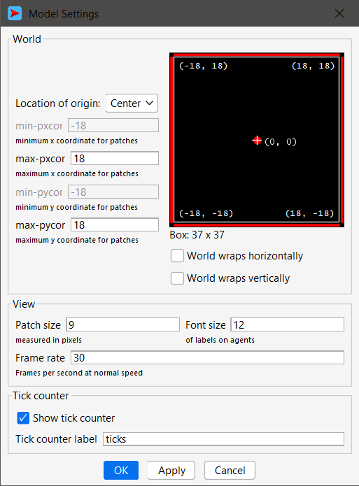
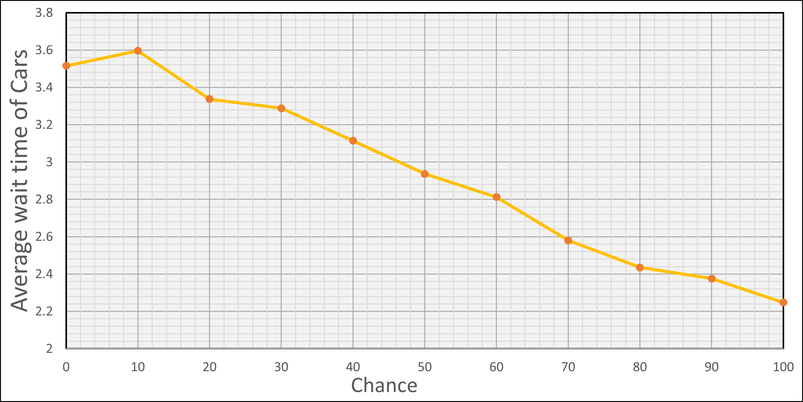
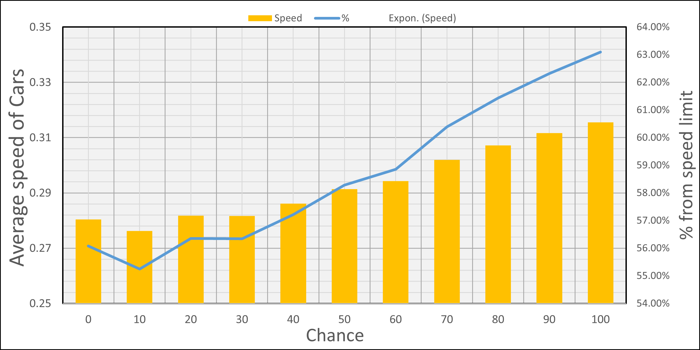

# Комп'ютерні системи імітаційного моделювання

# СПм-24-2, Аленевський Максим Олександрович

# Лабораторна робота №2. Редагування імітаційних моделей у середовищі NetLogo

Варіант 1, модель у середовищі NetLogo: [Traffic Grid](http://www.netlogoweb.org/launch#http://www.netlogoweb.org/assets/modelslib/Sample%20Models/Social%20Science/Traffic%20Grid.nlogox)


## Внесені зміни у вихідну логіку моделі, за варіантом:
*Додати жовтий сигнал світлофорів. Додати вірогідність початку руху на жовтий сигнал світлофора.*

Внесення змін було поділено на два етапи: 
- додавання жовтого сигналу світлофору;
- додавання вірогідності початку руху на жовтий сигнал світлофора;

Перш за все було додано константу **`yellow-signal-ticks`**, що відповідає тривалості сигналу:
``` NetLogo
globals
[
    ...
    yellow-signal-ticks      ;; the constant that defines the duration of yellow trafic lights.
    ...
]
```
Її значення встановлюється під час виконання процедури ***`to setup-globals`*** та дорівнює *4* за замовчуванням:

``` NetLogo
to setup-globals
    ...
    set yellow-signal-ticks 4
    ...
end
```

Для додавання зміни сигналу на жовтий було використано наступну логіку: нехай **`ticks-per-cycle`** - повна тривалість циклу зміни кольорів сигналу, тоді напочатку кожного нового циклу, коли **`phase == 0`**, вмикається жовтий сигнал світлофору та триває **`yellow-signal-ticks`** часу, далі, коли **`phase == yellow-signal-ticks`**, вмикається керуючий сигнал світлофору - зелений чи червоний. Ця логіка реалізована у процедурі ***`to set-signals`***:

``` NetLogo
to set-signals
    ask intersections with [auto? and phase = (floor ((my-phase * ticks-per-cycle) / 100))]
    [
        set-signal-colors
    ]
    ask intersections with [auto? and phase = (floor ((my-phase * ticks-per-cycle) / 100) + yellow-signal-ticks)]
    [
        set green-light-up? (not green-light-up?)
        set-signal-colors
    ]
end
```

Безпосередньо встановлення сигналу світлофору відбувається у процедурі **`set-signal-colors`**:

``` NetLogo
to set-signal-colors
    ifelse power?
    [
        ifelse phase < yellow-signal-ticks ;set yellow color of traffic lights
        [
            ask patch-at -1 0 [ set pcolor yellow ]
            ask patch-at 0 1 [ set pcolor yellow ]
        ]
        [
            ifelse green-light-up? ;set green/red color of traffic lights
            [
                ask patch-at -1 0 [ set pcolor red ]
                ask patch-at 0 1 [ set pcolor green ]
            ]
            [
                ask patch-at -1 0 [ set pcolor green ]
                ask patch-at 0 1 [ set pcolor red ]
            ]
        ] 
    ]
    [
        ask patch-at -1 0 [ set pcolor white ]
        ask patch-at 0 1 [ set pcolor white ]
    ]
end
```

Для додавання вірогідності початку руху на жовтий сигнал світлофору було додано ще один керуючий параметр **`yellow-drive-chance`**, його можна змінювати під час роботи моделі від 0 до 100 %.

Реалізація цієї логіки знаходиться у процедурі **`set-car-speed`**:

``` NetLogo
to set-car-speed 
    let rand (random 100 + 1) ;yellow-drive-chance
    
    if patch-ahead 1 != nobody [
        ifelse ([pcolor] of patch-ahead 1 = red)
        [ set speed 0 ]
        [
            (ifelse
                pcolor = yellow and (rand <= yellow-drive-chance) [ ;if it's yellow and a driver wants to start/countinue moving
                    ifelse up-car?
                    [ set-speed 0 -1 ]
                    [ set-speed 1 0 ]
                ]
                [pcolor] of patch-ahead 1 = yellow and (rand > yellow-drive-chance) [ ;if it's yellow and a driver doesn't want to start/countinue moving
                    set speed 0
                ]
                [
                    ifelse up-car?
                    [ set-speed 0 -1 ]
                    [ set-speed 1 0 ]
            ])
        ]
    ]
end
```

## Внесені зміни у вихідну логіку моделі, на власний розсуд:

Для можливого вдосконалення логіки моделі було обрано одну з проблем, описаних у попередній лабораторній роботі, а саме: замкненість світу, представлена у формі тору. У цьому контексті були змінені налаштування світу, зокрема, вимкнено параметри, які з'єднують протилежні краї світу: `World wraps horizontally / vertically`.`.



Далі було створено процедуру, яка повертає **`true`** коли машина знаходиться на краю світу (тільки для своєї дороги), в інших випадках дорівнює **`false`**:

``` NetLogo
to-report is-end-of-world
    (ifelse 
        ( pxcor = max-pxcor and up-car? = false ) [ report true ]
        ( pycor = min-pycor and up-car? = true ) [ report true ]
        [ report false ])
end
```

Наступним кроком є видалення тих автомобілів, що покидають межі світу моделі. Для цього були внесені зміни до основної процедури ***`to go`***, а саме було додано декілька інструкцій при опитуванні автомобілів:

``` NetLogo
to go
    ...
    ask turtles [
        set-car-speed
        fd speed
        record-data
        set-car-color
        if is-end-of-world [                 ;; if it's the end of the world
            set dead-number dead-number + 1  ;; increase the global counter of dead turtles and 
            die                              ;; kill the turtle
        ]
    ]
    ...
end
```

При опитуванні чергової машини визначається, чи знаходиться вона на краю світу. Якщо так, то ми збільшуємо кількість видалених автомобілів для подальшого їх "відродження" і видаляємо черговий автомобіль. В іншому випадку процес триває в звичайному режимі.

Крім того, було додано кілька нових процедур: ***`to relife-cars [road]`***, ***`to put-on-start-empty-road [road]`***, ***`to-report get-start-empty-road`***.

Процедура ***`to-report get-start-empty-road`*** має схожу функцію з ***`to put-on-empty-road [road]`***, яка шукає та розміщує автомобіль на вільному місці на дорозі. Однак вона відрізняється тим, що шукає вільне місце на початку кожної дороги і повертає його. Якщо вільного місця немає, повертається **`nobody`**.

``` NetLogo
to-report get-start-empty-road 
    report one-of roads with [not any? turtles-on self and (pxcor = min-pxcor or pycor = max-pycor)]
end
```
Ця процедура використовується в ***`to go`*** перед опитуванням автомобілів. У ній створюється локальна змінна **`start-dead-number`**, яка зберігає кількість видалених автомобілів на попередньому етапі моделювання. Далі в циклі відбувається створення нових автомобілів. Якщо вільних місць немає, нові машини не створюються, і цикл припиняється. Автомобілі, що залишилися, будуть створені при можливості на наступному етапі моделювання.

``` NetLogo
to go
    let start-dead-number dead-number
    repeat start-dead-number 
    [  
        let empty-road get-start-empty-road 
        ifelse empty-road != nobody
        [
            create-turtles 1 [
                relife-cars empty-road
                set-car-color
            ]
            set dead-number dead-number - 1
        ]
       
    ]
end
```

Процедура ***`to relife-cars [road]`*** майже повністю відповідає ***`to setup-cars`***, за виключенням, що для розміщення автомобілів використовується ***`to put-on-empty-road [road]`*** та відсумня перевірка для перехресть. Змінна **`road`** отримується за допомогою ***`to-report get-start-empty-road`***.

``` NetLogo
to relife-cars [road]
    set speed 0
    set wait-time 0
    
    put-on-start-empty-road road
    
    ifelse (floor((pxcor + max-pxcor - floor(grid-x-inc - 1)) mod grid-x-inc) = 0)
    [ set up-car? true ]
    [ set up-car? false ]
    
    ifelse up-car?
    [ set heading 180 ]
    [ set heading 90 ]
end
```

``` NetLogo
to put-on-start-empty-road [road]
  move-to road
end
```


Фінальний код моделі та її інтерфейс доступні за [посиланням](./Traffic%Grid_modified.nlogox).

## Обчислювальний експеримент 

### Експеримент №1: Залежність середнього часу очікування від проміжку часу між змінами сигналів світлофорів

*Початкові умови:*

- *Grid size x_y =* **3**
- *Num cars =* **70**
- *Power =* **true**
- *Speed limit =* **0.5** 
- *Yellow-signal-ticks =* **4**

*Результати експерименту:*


*Висновки:* Результати взагалом співпадають з цим же експериментом у попередній лабораторній роботі, проте у проміжках 5-15 вже не виникають ситуації, коли трафік блокується. Таким чином, внесені до моделі зміни роблять її більш адекватною до реального досвіду. 


### Експеримент №2: Залежність середнього часу очікування та середньої швидкості руху від вірогідності початку руху на жовтий сигнал світлофору

*Початкові умови:*
- *Grid size x_y =* **3**
- *Num cars =* **70**
- *Power =* **true**
- *Speed limit =* **0.5** 
- *Ticks per cycle =* **20**
- *Yellow-signal-ticks =* **4**

*Результати експерименту:*



*Висновки:* З графіку видно, що чим більше вірогідність початку руху (або "проскочити" перед червоним сигналом) на жовтий сигнал світлофору, тим вище середня швидкість автомобіля та тим менший час очікування початку руху, що цілком відповідає реальному досвіду.   

