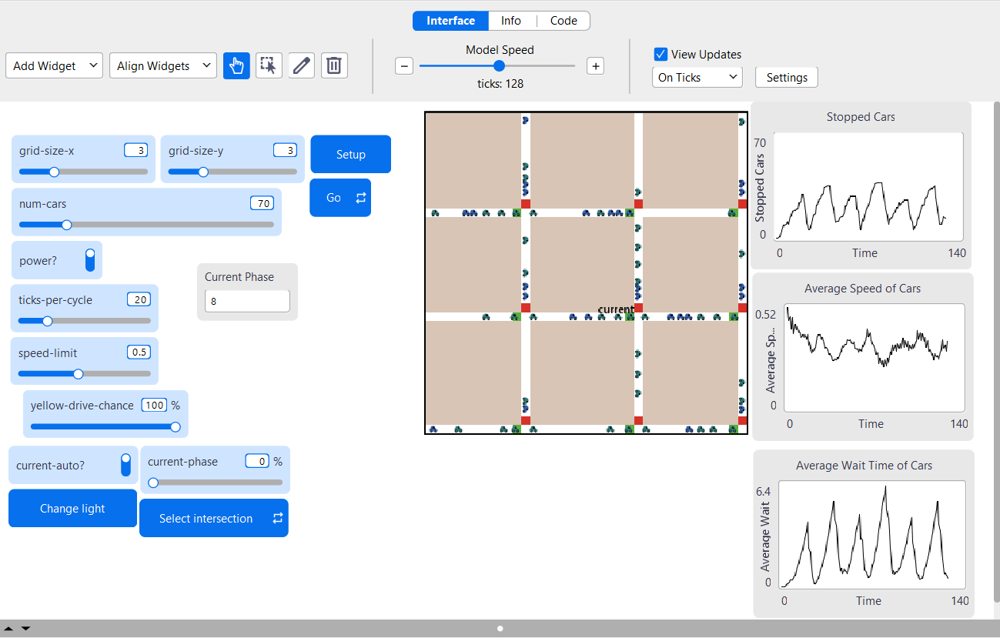
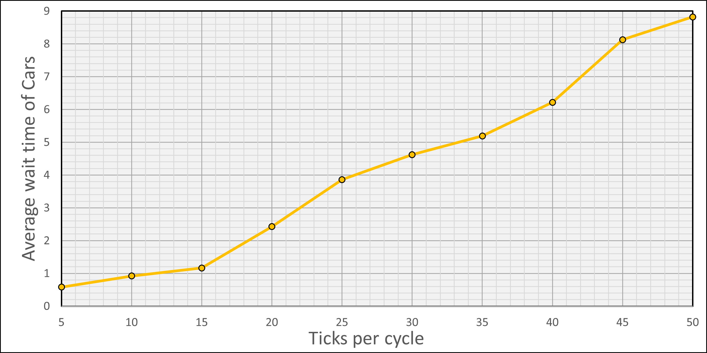
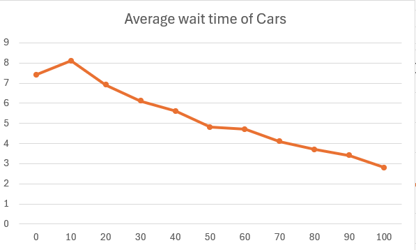

# Комп'ютерні системи імітаційного моделювання

# СПм-24-2, Аленевський Максим Олександрович

# Лабораторна робота №2. Редагування імітаційних моделей у середовищі NetLogo

Варіант 1, модель у середовищі NetLogo: [Traffic Grid](http://www.netlogoweb.org/launch#http://www.netlogoweb.org/assets/modelslib/Sample%20Models/Social%20Science/Traffic%20Grid.nlogox)


## Внесені зміни у вихідну логіку моделі, за варіантом:
*Додати жовтий сигнал світлофорів. Додати вірогідність початку руху на жовтий сигнал світлофора.*

Внесення змін було поділено на два етапи: 
- додавання жовтого сигналу світлофору;
- додавання вірогідності початку руху на жовтий сигнал світлофора;

Перш за все було додано константу **`yellow-signal-ticks`**, що відповідає тривалості сигналу:
``` NetLogo
globals
[
    ...
    yellow-signal-ticks      ;; the constant that defines the duration of yellow trafic lights.
    ...
]
```
Її значення встановлюється під час виконання процедури ***`to setup-globals`*** та дорівнює *4* за замовчуванням:

``` NetLogo
to setup-globals
    ...
    set yellow-signal-ticks 4
    ...
end
```

Для додавання зміни сигналу на жовтий було використано наступну логіку: нехай **`ticks-per-cycle`** - повна тривалість циклу зміни кольорів сигналу, тоді напочатку кожного нового циклу, коли **`phase == 0`**, вмикається жовтий сигнал світлофору та триває **`yellow-signal-ticks`** часу, далі, коли **`phase == yellow-signal-ticks`**, вмикається керуючий сигнал світлофору - зелений чи червоний. Ця логіка реалізована у процедурі ***`to set-signals`***:

``` NetLogo
to set-signals
    ask intersections with [auto? and phase = (floor ((my-phase * ticks-per-cycle) / 100))]
    [
        set-signal-colors
    ]
    ask intersections with [auto? and phase = (floor ((my-phase * ticks-per-cycle) / 100) + yellow-signal-ticks)]
    [
        set green-light-up? (not green-light-up?)
        set-signal-colors
    ]
end
```

Безпосередньо встановлення сигналу світлофору відбувається у процедурі **`set-signal-colors`**:

``` NetLogo
to set-signal-colors
    ifelse power?
    [
        ifelse phase < yellow-signal-ticks ;set yellow color of traffic lights
        [
            ask patch-at -1 0 [ set pcolor yellow ]
            ask patch-at 0 1 [ set pcolor yellow ]
        ]
        [
            ifelse green-light-up? ;set green/red color of traffic lights
            [
                ask patch-at -1 0 [ set pcolor red ]
                ask patch-at 0 1 [ set pcolor green ]
            ]
            [
                ask patch-at -1 0 [ set pcolor green ]
                ask patch-at 0 1 [ set pcolor red ]
            ]
        ] 
    ]
    [
        ask patch-at -1 0 [ set pcolor white ]
        ask patch-at 0 1 [ set pcolor white ]
    ]
end
```

Для додавання вірогідності початку руху на жовтий сигнал світлофору було додано ще один керуючий параметр **`yellow-drive-chance`**, його можна змінювати під час роботи моделі від 0 до 100 %.

Реалізація цієї логіки знаходиться у процедурі **`set-car-speed`**:

``` NetLogo
to set-car-speed 
    let rand (random 100 + 1) ;yellow-drive-chance
    
    if patch-ahead 1 != nobody [
        ifelse ([pcolor] of patch-ahead 1 = red)
        [ set speed 0 ]
        [
            (ifelse
                pcolor = yellow and (rand <= yellow-drive-chance) [ ;if it's yellow and a driver wants to start/countinue moving
                    ifelse up-car?
                    [ set-speed 0 -1 ]
                    [ set-speed 1 0 ]
                ]
                [pcolor] of patch-ahead 1 = yellow and (rand > yellow-drive-chance) [ ;if it's yellow and a driver doesn't want to start/countinue moving
                    set speed 0
                ]
                [
                    ifelse up-car?
                    [ set-speed 0 -1 ]
                    [ set-speed 1 0 ]
            ])
        ]
    ]
end
```

## Внесені зміни у вихідну логіку моделі, на власний розсуд:

Для можливого вдосконалення логіки моделі було обрано одну з проблем, описаних у попередній лабораторній роботі, а саме: нереалістична поведінка автомобілів при наближені до перешкод. Автомобілі гальмували моментально безпосередньо перед автомобілем попереду. Для цього було змінено процедуру **`set-speed`**.

На початку було визначено локальні змінні для нової процедури
- let my-x xcor: зберігає поточну x‑координату черепахи в локальну змінну my-x для подальших обчислень.
- let my-y ycor: зберігає поточну y‑координату в my-y.
- let my-up up-car?: зчитує прапорець напрямку (наприклад, чи рухається черепаха "вгору") в my-up; використовується для вибору осі пошуку лідера.
- let my-who who: зберігає унікальний ідентифікатор черепахи в my-who, щоб виключити себе з пошуку інших черепах.
- let tol 0.5: встановлює допуск tol для визначення «смуги» — наскільки близько по перпендикулярній координаті має бути інша черепаха, щоб вважатися в тій же смузі.
- let leader nobody: ініціалізує змінну leader як nobody — поки що лідер не знайдений.
- let gap 9999: ініціалізує gap великим значенням (маркер «невідомо/дуже далеко»), потім при знаходженні лідера буде перезаписано.

``` NetLogo
let my-x xcor
  let my-y ycor
  let my-up up-car?
  let my-who who

  let tol 0.5
  let leader nobody
  let gap 9999
```
Далі було описано функцію пошуку **`лідера`** в смузі поточної машини та обчислює відстань до неї (**`gap`**) 
``` NetLogo
 if my-up [
    let same-lane turtles with [ abs (xcor - my-x) < tol and up-car? = my-up and who != my-who ] ;; note: if you have different var name, keep original
    let ahead same-lane with [ ycor < my-y ]
    if any? ahead [
      set leader min-one-of ahead [ my-y - ycor ]
      set gap ((my-y - [ycor] of leader) / grid-y-inc)
    ]
  ]
  if not my-up [
    let same-lane turtles with [ abs (ycor - my-y) < tol and up-car? = my-up and who != my-who ]
    let ahead same-lane with [ xcor > my-x ]
    if any? ahead [
      set leader min-one-of ahead [ xcor - my-x ]
      set gap (([xcor] of leader - my-x) / grid-x-inc)
    ]
  ]
```

Наступним кроком перевіряється чи є лідер у поточної машини, за його  відстності встановлюється максимально дозволена швидкість.
``` NetLogo
 ifelse leader = nobody [
    ;; Немає лідера — набираємо до максимальної дозволеної швидкості
    speed-up
  ]
  [
    let leader-speed [speed] of leader
```

Вводимо налаштувальні параметри для регулювання відстання початку гальмування, інтенсивності гальмування, коефіцієнт під'їзду, максимальну швидкість при під'їзді.
``` NetLogo
    let desired-gap 1.0            ;; мінімальний зазор в клітинах (зупинка тут)
    let safe-distance 0.1         ;; починаємо гальмувати, коли gap <= safe-distance
    let brake-start 10.0          ;; (запас) відстань для поступового під'їзду до зупиненого лідера
    let approach-k 1.0            ;; коефіцієнт для під'їзду (коли лідер стоїть, але далеко)
    let max-approach-speed speed-limit ;; максимальна швидкість при під'їзді
    let brake-strength 2.0        ;; наскільки сильніше можемо гальмувати при малій відстані (множник)

    ;; Обчислюємо цільову швидкість (target-speed)
    let target-speed 0
```

Далі прораховуємо випадки коли лідер рухається або стоїть. Якщо лідер рухається, перевіряється чи достатня відстань для руху без обмеження. Якщо лідер знаходиться близько до поточної машини починається процес зниженняя швидкості до швидкості лідера. У випадку коли лідер стоїть перевіряється чи знаходиться машина в зоні гальмування. Якщо поточна машина знаходиться в зоні гальмування перед лідером - машина почина гальмувати.
``` NetLogo
    if leader-speed > 0 [
      ;; Лідер рухається
      ifelse gap > safe-distance [
        ;; Достатній зазор — підлаштовуємося під лідера і можемо набирати до speed-limit
        set target-speed min (list speed-limit (leader-speed * 0.95 + (speed-limit - leader-speed) * 0.1))
      ] [
        ;; Менший зазор — починаємо гальмувати пропорційно до відстані
        ;; Коли gap == safe-distance => target близький до leader-speed*0.95
        ;; Коли gap -> desired-gap => target -> 0 або до дуже малої швидкості
        let denom max (list 0.0001 (safe-distance - desired-gap))
        let factor max (list 0 (min (list 1 ((gap - desired-gap) / denom))))
        ;; підлаштовуємося під лідера, але зменшуємо пропорційно factor
        set target-speed max (list 0 (leader-speed * 0.95 * factor))
      ]
    ]

    if leader-speed = 0 [
      ;; Лідер стоїть — визначаємо фактор гальмування залежно від gap
      ifelse gap > brake-start [
        ;; Далеко від зупиненого лідера — рухаємося з під'їзною швидкістю (помірно швидко)
        set target-speed min (list max-approach-speed (approach-k * (gap - desired-gap)))
      ] [
        ;; У зоні гальмування або дуже близько — лінійно зменшуємо швидкість до 0
        let denom max (list 0.0001 (brake-start - desired-gap))
        let braking-factor max (list 0 (min (list 1 ((gap - desired-gap) / denom))))
        set target-speed max (list 0 (max-approach-speed * braking-factor))
      ]
    ]
```

В останньому блоці була описана функція для плавного прискорення та динамічного гальмування. Розрахрвується інтенсивність гальмування та прискорення до лідера.
``` NetLogo
      if speed > target-speed [
      ;; Розрахунок динамічного темпу гальмування:
      let braking-factor 1.0
      if leader-speed = 0 [
        let denom max (list 0.0001 (brake-start - desired-gap))
        set braking-factor max (list 0 (min (list 1 ((gap - desired-gap) / denom))))
      ] 
      if leader-speed > 0 and gap <= safe-distance [
        let denom2 max (list 0.0001 (safe-distance - desired-gap))
        let factor2 max (list 0 (min (list 1 ((gap - desired-gap) / denom2))))
        set braking-factor factor2
      ]
      ;; decel-rate: базове acceleration помножене на коефіцієнт, що зростає коли braking-factor малий
      let decel-rate acceleration * (1 + (1 - braking-factor) * brake-strength)
      set speed max (list target-speed (speed - decel-rate))
    ]
    if speed < target-speed [
      ;; Прискорюємося звичайним acceleration
      set speed min (list target-speed (speed + acceleration))
    ]
```



Фінальний код моделі та її інтерфейс доступні за [посиланням](Lb2/Traffic%Grid_modified.nlogox).

## Обчислювальний експеримент 

### Експеримент №1: Залежність середнього часу очікування від проміжку часу між змінами сигналів світлофорів

*Початкові умови:*

- *Grid size x_y =* **3**
- *Num cars =* **70**
- *Power =* **true**
- *Speed limit =* **0.5** 
- *Yellow-signal-ticks =* **4**

*Результати експерименту:*


*Висновки:* Результати взагалом співпадають з цим же експериментом у попередній лабораторній роботі, проте у проміжках 5-15 вже не виникають ситуації, коли трафік блокується. Таким чином, внесені до моделі зміни роблять її більш адекватною до реального досвіду. 


### Експеримент №2: Залежність середнього часу очікування від вірогідності початку руху на жовтий сигнал світлофору

*Початкові умови:*
- *Grid size x_y =* **3**
- *Num cars =* **70**
- *Power =* **true**
- *Speed limit =* **0.5** 
- *Ticks per cycle =* **20**
- *Yellow-signal-ticks =* **4**

*Результати експерименту:*



*Висновки:* З графіку видно, що чим більше вірогідність початку руху (або "проскочити" перед червоним сигналом) на жовтий сигнал світлофору, тим менший час очікування початку руху, що цілком відповідає реальному досвіду.   

