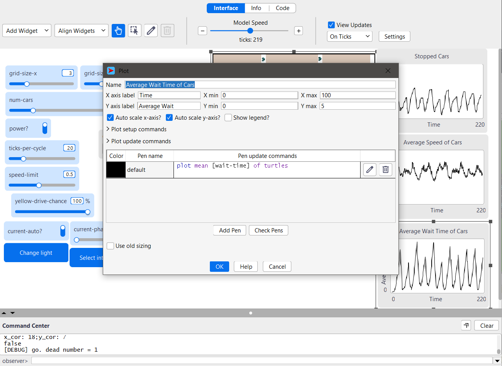
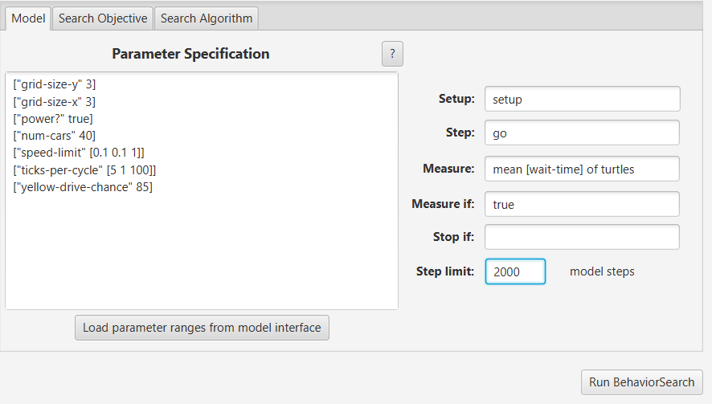
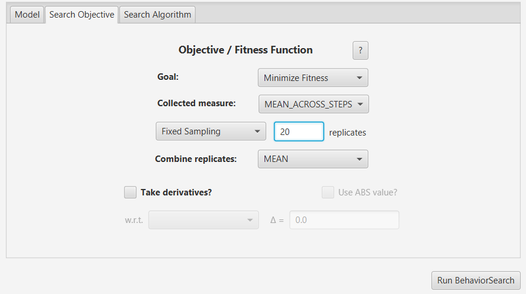
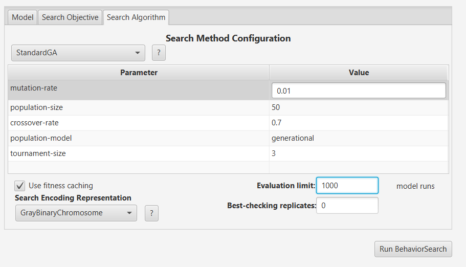
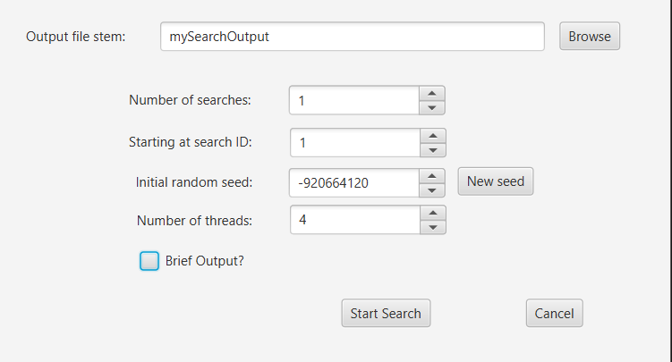
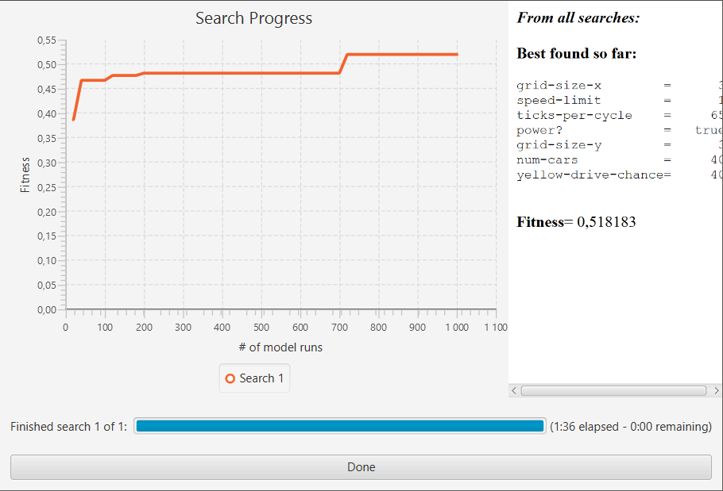
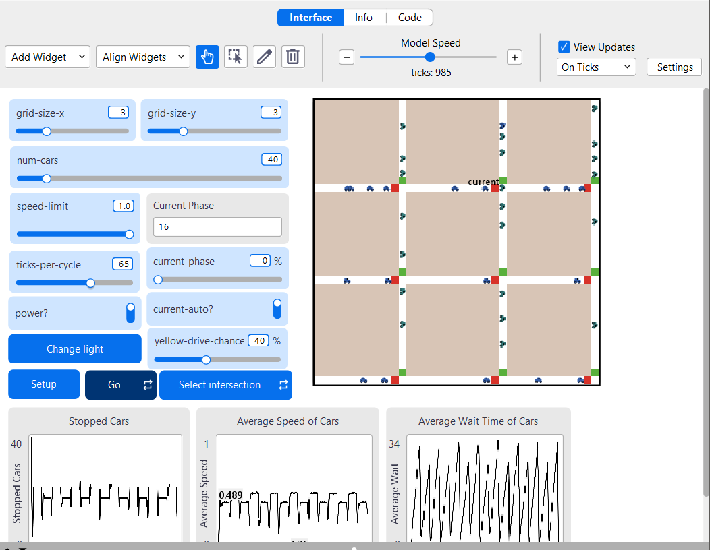

# Комп'ютерні системи імітаційного моделювання

# СПм-24-2, Аленевський Максим Олександрович

# Лабораторна робота №3. Використання засобів обчислювального інтелекту для оптимізації імітаційних моделей

Варіант 1, модель у середовищі NetLogo: [Traffic Grid](http://www.netlogoweb.org/launch#http://www.netlogoweb.org/assets/modelslib/Sample%20Models/Social%20Science/Traffic%20Grid.nlogox)

## Вербальний опис моделі:
Модель міського трафіку, організованого за сітковою схемою. Вона дозволяє регулювати світлофори, а також змінювати глобальні параметри, такі як обмеження швидкості та кількість автомобілів, що дає змогу аналізувати динаміку руху.

На кожному кроці автомобілі рухаються вперед із поточною швидкістю. Якщо їхня швидкість нижча за максимально дозволену і попереду немає інших машин, вони прискорюються. Якщо попереду є автомобіль, що рухається повільніше, інші підлаштовують свою швидкість відповідно до нього. При червоному світлі світлофора або коли попереду стоїть автомобіль, вони зупиняються.


### Внутрішні параметри:

### Глобальні параметри:

- **acceleration** - константа, що відповідає за прискорення всих машин
- **grid-x-inc** - кількість "патчів" між двома дорогами за \*х\* координатами
- **grid-y-inc** - кількість "патчів" між двома дорогами за \*у\* координатами
- **num-cars-stopped** - лічильник, що рахує кількість зупинених машин та кількість машин, що стоять, на поточному кроці моделювання
- **phase** - лічильник поточної фази циклу перемикань світлофорів

### Параметри машин 

- **speed** - швидкість машини
- **up-car** - напрямок руху машини (униз, вправо)
- **wait-time** - лічильник, що рахує кількість часу, що минуло після останнього руху


### Параметри доріг/ділянок 

- **intersection** - \*правда\*, якщо ділянка знаходиться на перехресті двох доріг;
- **green-light-up** - \*правда\*, якщо зелене світло над перехрестям, інакше - \*неправда\*;
- **my-row** - рядок перехрестя, -1 для ділянок, що не перетинаються.
- **my-column** - стовпець перехрестя, -1 для ділянок, що не перетинаються.
- **my-phase** - фаза перехрестя
- **auto** - параметр, що відповідає за автоматичне перемикання перехрестя. \*неправда\* для ділянок без перехресть.

## Налаштування середовища BehaviorSearch

Параметри моделі (вкладка Model):

</br>["grid-size-y" 3]
</br>["grid-size-x" 3]
</br>["power?" true]
</br>["num-cars" 40]
</br>["speed-limit" [0.1 0.1 1]]
</br>["ticks-per-cycle" [5 1 100]]
</br>["yellow-drive-chance" 85]

Використовувана міра:
У якості міри ефективності було обрано середню швидкість руху автомобілів. Формула для його розрахунку взята з параметрів графіка, налаштованого в аналізованій імітаційній моделі середовища NetLogo.



та вказано у параметрі "Measure":

``` NetLogo
mean [wait-time] of turtles
```

Середній швидкість автомобілів розраховувалась на основі значень для всіх машин протягом усього періоду симуляції, наприклад, 2000 тактів. На кожному такті враховувалась швидкість кожного автомобіля і на основі цих даних обчислювалась поточна середня швидкість з 0 такту.
Параметр "Measure if" встановлено в значення true, оскільки для аналізу необхідно враховувати кожне значення показника.
Параметр зупинки за умовою "Stop if" не використовувався в даній моделі.
Загальний вигляд вкладки налаштувань параметрів моделі:



## Налаштування цільової функції (вкладка Search Objective):

Метою підбору параметрів імітаційної моделі, яка описує дорожній рух, є максимізація середньої швмдкості автомобілів. Ця мета задається через параметр "Goal" зі значенням Maximize Fitness. Завдання полягає у визначенні таких параметрів налаштувань моделі, при яких автомобілі рухаються з найвищою середньою швидкістю.
Середня швидкість розраховується за всю тривалість симуляції, що складає 2000 тактів. Для цього у параметрі "Collected measure", який визначає спосіб збору даних обраного показника, встановлено значення MEAN_ACROSS_STEPS.
Для уникнення викривлення результатів через випадкові значення, що застосовуються в логіці імітаційної моделі, кожна симуляція повторюється 20 разів. Підсумкове значення розраховується як середнє арифметичне отриманих результатів.
Загальний вигляд вкладки налаштувань цільової функції:



## Налаштування алгоритму пошуку (вкладка Search Algorithm):

Загальний вид вкладки налаштувань алгоритму пошуку:



## Результати використання BehaviorSearch



Результат пошуку параметрів імітаційної моделі, використовуючи генетичний алгоритм:


Результат пошуку параметрів імітаційної моделі, використовуючи випадковий пошук:


## Перевірка результатів в NetLogo



### Висновки

1. Обидва алгоритми продемонстрували «східчастий» характер покращення результатів. На графіках видно різкі спади значення фітнес-функції, що чергуються з довгими періодами стабільності. Це свідчить про те, що ключовий параметр (ймовірно, ticks-per-cycle) суттєво впливає на пропускну здатність: як тільки алгоритм знаходить вдалий діапазон циклів перемикання світлофора, ефективність системи різко зростає.

2. У цьому експерименті Випадковий пошук (Random Search) виявився ефективнішим за Генетичний алгоритм. Він знайшов рішення з більшим показником фітнес-функції — 0.518 проти 0.509 у ГА. Випадковий пошук пізніше вийшов на своє оптимальне значення (близько 720-го прогону), тоді як ГА досяг свого максимума раніше (після 650-го прогону), але зупинився на трохи гіршому локальному оптимумі.

3. Перемога випадкового пошуку у даному випадку пояснюється відносною простотою простору пошуку (змінювалися переважно два параметри: speed-limit та ticks-per-cycle). Для маловимірних задач випадковий перебір часто може «поцілити» в глобальний оптимум швидше, ніж еволюційні методи встигнуть налаштувати популяцію. Генетичний алгоритм «застряг» на обмеженні частоти перемикання світлофорів 25, тоді як Random Search випадково знайшов більш вдале поєднання зі частотою 65.
